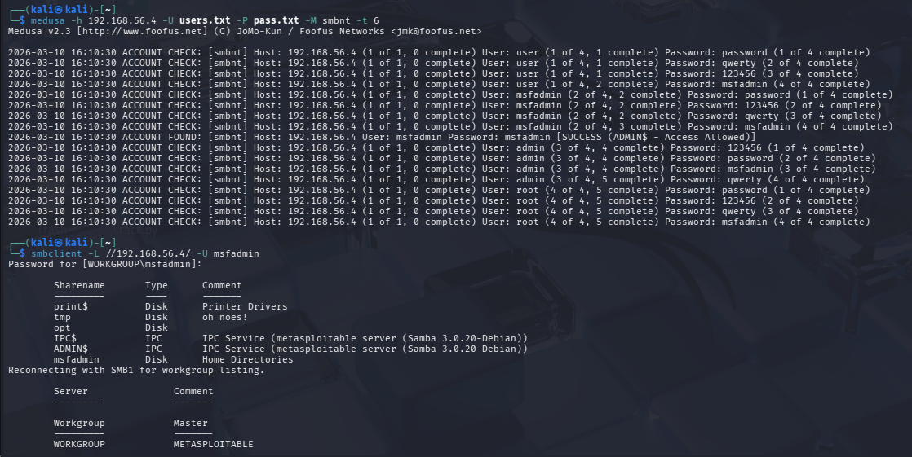
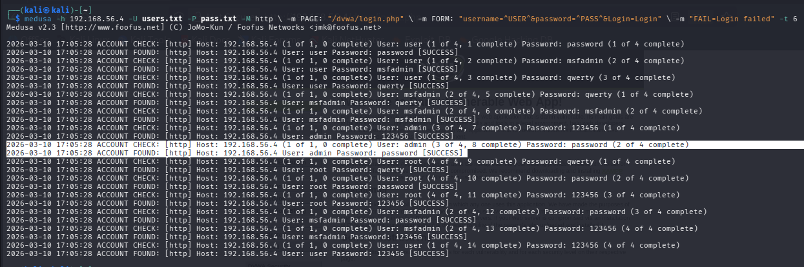
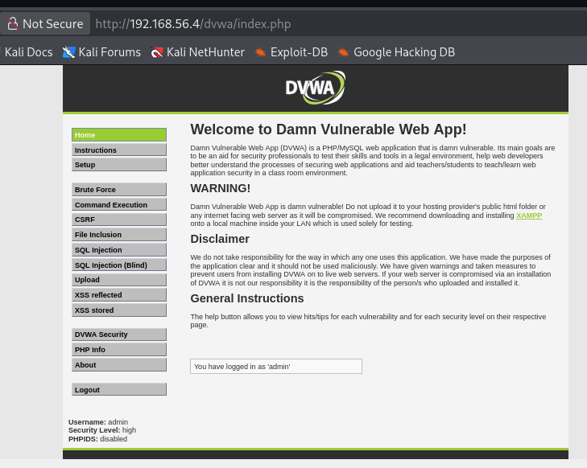

# dio-bruteforce-medusa
Projeto prático de simulação de ataques de força bruta em serviços FTP, SMB e Web utilizando Kali Linux, Medusa e Metasploitable 2 em ambiente controlado.


## Enumeração inicial
Foi realizada uma varredura com Nmap no host alvo `192.168.56.4` para identificar os serviços relevantes ao escopo do laboratório.

### Comando utilizado
```bash
nmap -sV -Pn -p 21,80,139,445 192.168.56.4
```


### Serviços identificados
- **21/tcp** - FTP
- **80/tcp** - HTTP
- **139/tcp** - SMB
- **445/tcp** - SMB

### Preparação das wordlists
Para direcionar os testes aos serviços em escopo e evitar tentativas excessivas no ambiente controlado, foram criadas wordlists reduzidas e customizadas com usuários e senhas comuns do laboratório.
Os arquivos utilizados (`users.txt` e `pass.txt`) estão disponíveis na pasta `wordlists/`.


## Ataque ao serviço FTP
Após a enumeração inicial, foi realizado um teste de força bruta controlado contra o serviço FTP exposto na porta 21 do host alvo `192.168.56.4`.

### Comando utilizado
```bash
medusa -h 192.168.56.4 -U users.txt -P pass.txt -M ftp -t 6
```
### Resultado obtido
O Medusa identificou uma credencial válida para o serviço FTP:

- **Usuário:** `msfadmin`
- **Senha:** `msfadmin`

### Validação do acesso
Após a identificação da credencial, o acesso foi validado manualmente com o cliente FTP do sistema, confirmando autenticação bem-sucedida no servidor.


## Ataque de força bruta ao serviço SMB
Foi realizado um teste de força bruta controlado contra o serviço SMB exposto nas portas `139` e `445` do host alvo `192.168.56.4`.

### Comando utilizado
```bash
medusa -h 192.168.56.4 -U users.txt -P pass.txt -M smbnt -t 6
```
### Resultado obtido
O Medusa identificou uma credencial válida para o serviço SMB:

- **Usuário:** `msfadmin`
- **Senha:** `msfadmin`
- 
### Validação do acesso
Após a identificação da credencial, o acesso foi validado com smbclient, listando os compartilhamentos disponíveis no servidor.



## Ataque a Aplicação Web (DVWA)
Foi realizada uma tentativa inicial de automação do formulário de login principal do DVWA com o Medusa.

### Comando utilizado

```bash
medusa -h 192.168.56.4 -U users.txt -P pass.txt -M http \
  -m PAGE:"/dvwa/login.php" \
  -m FORM:"username=^USER^&password=^PASS^&Login=Login" \
  -m "FAIL=Login failed" -t 6
```


## Login Efetuado com Sucesso:



## Conclusões e Medidas de Defesa
A execução deste laboratório permitiu compreender como senhas fracas, credenciais previsíveis e serviços mal configurados podem facilitar acessos indevidos em diferentes protocolos.
Durante os testes em ambiente controlado, foi possível identificar cenários de brute force e validar acessos em serviços como FTP e SMB, além de observar limitações e falsos positivos na automação do login principal da aplicação DVWA.
Para mitigar esse tipo de risco, recomenda-se:

1. **Políticas de senhas:** exigir senhas complexas e trocas periódicas.
2. **Bloqueio de conta:** configurar bloqueio após tentativas de autenticação falhas.
3. **Desativação de protocolos legados:** desabilitar serviços desnecessários ou versões antigas de protocolos, como SMBv1.
4. **Uso de MFA:** implementar autenticação multifator sempre que possível.

## Estrutura do repositório
- `README.md`: documentação principal do laboratório
- `images/`: evidências visuais da enumeração, preparação e validação dos testes
- `wordlists/`: listas de usuários e senhas utilizadas
- `scripts/`: espaço reservado para automações e comandos auxiliares
- `notes/`: anotações e observações do laboratório

## Autor
Desenvolvido por **Lukas Takagi** como projeto prático na DIO.
