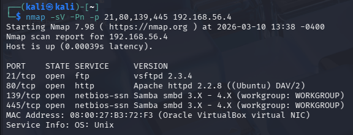
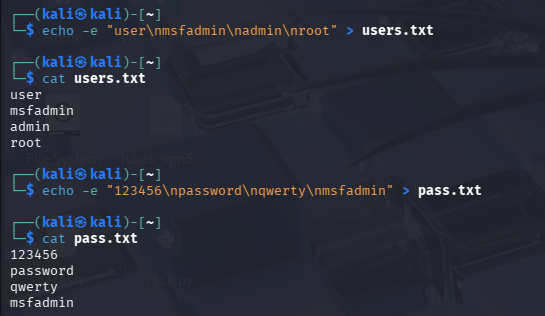
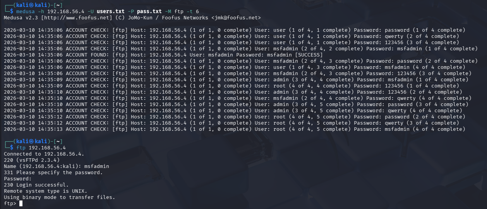

# dio-bruteforce-medusa
Projeto prático de simulação de ataques de força bruta em serviços FTP, SMB e Web utilizando Kali Linux, Medusa e Metasploitable 2 em ambiente controlado.


## Enumeração inicial
Foi realizada uma varredura com Nmap no host alvo `192.168.56.4` para identificar os serviços relevantes ao escopo do laboratório.

### Comando utilizado
```bash
nmap -sV -Pn -p 21,80,139,445 192.168.56.4
```


### Serviços identificados
- **21/tcp** - FTP
- **80/tcp** - HTTP
- **139/tcp** - SMB
- **445/tcp** - SMB

### Preparação das wordlists
Para direcionar os testes aos serviços em escopo e evitar tentativas excessivas no ambiente controlado, foram criadas wordlists reduzidas e customizadas com usuários e senhas comuns do laboratório.
Os arquivos utilizados (`users.txt` e `pass.txt`) estão disponíveis na pasta `wordlists/`.




## Ataque ao serviço FTP
Após a enumeração inicial, foi realizado um teste de força bruta controlado contra o serviço FTP exposto na porta 21 do host alvo `192.168.56.4`.

### Comando utilizado
```bash
medusa -h 192.168.56.4 -U users.txt -P pass.txt -M ftp -t 6
```
### Resultado obtido
O Medusa identificou uma credencial válida para o serviço FTP:

- **Usuário:** `msfadmin`
- **Senha:** `msfadmin`

### Validação do acesso
Após a identificação da credencial, o acesso foi validado manualmente com o cliente FTP do sistema, confirmando autenticação bem-sucedida no servidor.


